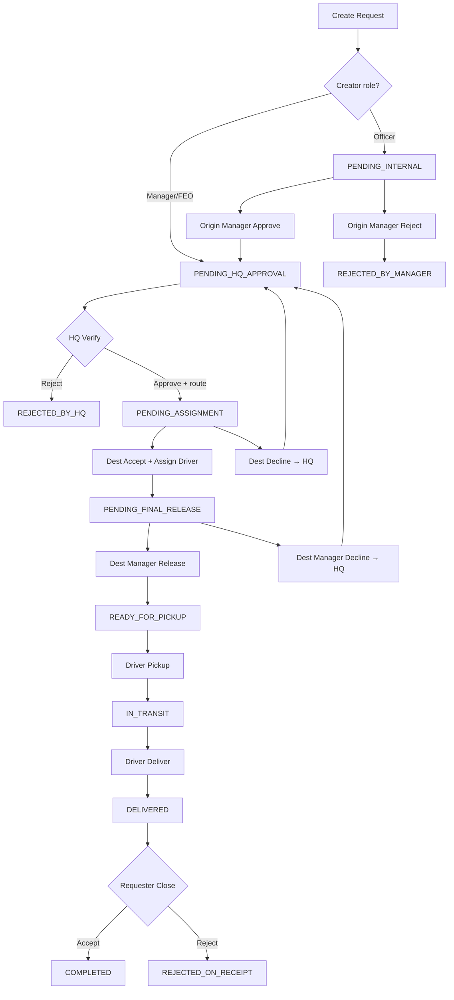

# BranchSync — Complete Project Overview

**Jamuna Bank PLC · Inter-Branch Transfer, Requisition & Cash Vault System**

BranchSync is an internal banking operations platform that coordinates the secure movement of physical assets between branches—stationery, IT equipment, security items, customer documents, cheque books, demand drafts, and **Cash Bundle** settlements. Every transfer follows a strict, auditable state machine with HQ central routing, branch-level approvals, courier handoffs, and optional real-time vault ledger tracking for cash.

This document describes **what exists in the repository today**—roles, features, workflows, screens, APIs, and data model—so developers, operators, and auditors can understand the full system without reading the code first.

---

## Table of Contents

1. [Executive Summary](#1-executive-summary)
2. [Technology Stack](#2-technology-stack)
3. [Core Concepts & Terminology](#3-core-concepts--terminology)
4. [Organizational Architecture](#4-organizational-architecture)
5. [User Roles — Who Does What](#5-user-roles--who-does-what)
6. [Item Categories & Access Rules](#6-item-categories--access-rules)
7. [Transfer Lifecycle — Full Workflow](#7-transfer-lifecycle--full-workflow)
8. [Transfer Status Reference](#8-transfer-status-reference)
9. [Rejection, Return-to-HQ & Re-Routing](#9-rejection-return-to-hq--re-routing)
10. [Cash Bundle & Vault Ledger System](#10-cash-bundle--vault-ledger-system)
11. [Frontend Application — Pages & Navigation](#11-frontend-application--pages--navigation)
12. [Role-Based UI Access Matrix](#12-role-based-ui-access-matrix)
13. [Backend API Reference](#13-backend-api-reference)
14. [Database Model](#14-database-model)
15. [Security, Authentication & Audit](#15-security-authentication--audit)
16. [Notable Product Features](#16-notable-product-features)
17. [Project Structure & Related Docs](#17-project-structure--related-docs)
18. [Local Development (Quick Start)](#18-local-development-quick-start)

---

## 1. Executive Summary

| Aspect | Detail |
|--------|--------|
| **Purpose** | Digitize inter-branch asset requests with enforced approvals, HQ routing, courier tracking, and cash vault automation |
| **Users** | Branch officers, managers, HQ logistics, delivery couriers, system administrators |
| **Transfer types** | 13 seeded categories (cash, cheques, IT, stationery, security, etc.) |
| **Workflow depth** | Up to **8 logical steps** (initiation → internal approval → HQ allocation → destination accept → final release → pickup → delivery → receipt verification) |
| **Cash tracking** | **Cash Bundle** category only—denomination breakdown, balance checks, ledger, manual adjustments |
| **Audit** | Immutable `audit_logs` on every status change; scoped visibility by role |
| **Repo layout** | Monorepo: `backend/` (Spring Boot), `frontend/` (React + Vite), SQL migrations & seed data |

---

## 2. Technology Stack

### Backend (`backend/`)

- **Java 21**, **Spring Boot 3**
- **Spring Security** + **JWT** (stateless sessions)
- **Spring Data JPA** / Hibernate
- **MariaDB / MySQL** database
- Password hashing: custom **SHA-256** encoder (`Sha256PasswordEncoder`)
- Default API port: **8080**

### Frontend (`frontend/`)

- **React 18**, **TypeScript**, **Vite**
- **React Router** for routing
- **Axios** with JWT interceptor (`api/axiosConfig.ts`)
- **AuthContext** — persisted login in `localStorage`
- Default dev port: **5173**

### Infrastructure

- `docker-compose.yml` — optional containerized backend/frontend (DB typically local/XAMPP)
- Schema: `backend/src/main/resources/db/migration/branchsync.sql` (+ `cash_tracking_migration.sql` if upgrading legacy DB)

---

## 3. Core Concepts & Terminology

Understanding **origin vs destination** is essential—the naming follows *who needs the asset*, not *where the courier starts*.

| Term | Meaning |
|------|---------|
| **Transfer request** | A tracked record for moving physical items; code format `REQ-YYYY-####` (e.g. `REQ-2026-0012`) |
| **Origin branch / department** | Branch that **initiated** the request and **receives** the package at the end (the requester) |
| **Destination branch / department** | Branch **assigned by HQ** to **supply and release** the assets; courier **picks up here** |
| **HQ Logistics** | Central officer who reviews requests and assigns destination branch + department |
| **Deferred destination** | Requesters do **not** pick destination at creation—HQ assigns it after internal approval |
| **Priority** | `NORMAL`, `HIGH`, `URGENT`, `CRITICAL` |
| **Sensitivity** | Per category: `LOW`, `MEDIUM`, `HIGH`, `CRITICAL` |
| **Delivery person** | Courier with `is_available` flag (`true` = can be assigned; set `false` while `IN_TRANSIT`) |
| **Audit trail** | Append-only log: actor, action, from/to status, remarks, timestamp, IP |

### Physical flow (mental model)

```
[Destination branch]  ──pickup (Step 5)──►  IN_TRANSIT  ──delivery (Step 6)──►  [Origin branch]
     (sends asset)                                                              (receives asset)
```

For **Cash Bundle**: vault balance decreases at **destination** on pickup and increases at **origin** on delivery (reversed if receipt is rejected).

---

## 4. Organizational Architecture

### Branches

- Stored in `branches`: code, name, type (`HQ`, `AD_BRANCH`, `SUB_BRANCH`), district, division, address, contact, `is_active`
- Seeded examples: Head Office Motijheel, Dhaka Main, Chittagong Agrabad, Sylhet, Rajshahi, Khulna, Faridpur Jhiltuli, etc.

### Departments (global master list)

Departments are **not owned by a single branch in the table**—they are linked to branches via **`branch_departments`** (many-to-many).

| ID | Department | HQ-only flag |
|----|------------|--------------|
| 1 | Cash Operations | No |
| 2 | IT Department | No |
| 3 | General Administration | No |
| 4 | Security & Compliance | No |
| 5 | Human Resources | No |
| 6 | Customer Service | No |
| 7 | Central Logistics Control | **Yes** (`is_hq_only`) |

**HQ-only departments** exist for HQ staff (e.g. Central Logistics Control) and are not treated like normal branch departments for routing.

### Users

- Each user: `employee_id`, password, `full_name`, email, phone, **role**, optional **branch**, optional **department**, `is_active`, `is_available` (delivery persons)
- **System Admin** and **Delivery Person** are typically branch-agnostic; branch staff must belong to a branch (and usually a department)

### Item ownership

- Each `item_category` may map to a **responsible department** (`department_id`)
- **`department_id = NULL`** → **open access** (any officer can request, e.g. First Aid Kit)
- Regular **OFFICER** users only see categories mapped to **their** `departmentId` on the New Request form; managers and above see all categories

---

## 5. User Roles — Who Does What

| Role | Code | Branch context | Primary responsibilities |
|------|------|----------------|---------------------------|
| **System Admin** | `SYSTEM_ADMIN` | Global | User CRUD, branch/department/category master data, view all transfers & ledgers, consolidated cash reports |
| **HQ Logistics Officer** | `HQ_LOGISTICS_OFFICER` | HQ | Review `PENDING_HQ_APPROVAL` queue; assign destination branch + department; approve or reject; see branch cash balances when routing Cash Bundle |
| **Branch Manager** | `BRANCH_MANAGER` | One branch | Internal approve/reject (origin); final release (destination); approve cash adjustments; branch directory; cash ledger |
| **Operation Manager** | `OPERATION_MANAGER` | One branch | Same manager powers as Branch Manager |
| **First Executive Officer** | `FIRST_EXECUTIVE_OFFICER` | One branch | Same manager powers; **bypasses** `PENDING_INTERNAL` on create (goes straight to HQ) |
| **Officer** | `OFFICER` | Branch + dept | Create requests; destination accept + assign driver; submit denominations (cash); submit manual cash adjustments; final receipt verify |
| **Delivery Person** | `DELIVERY_PERSON` | Floating | Pickup (`READY_FOR_PICKUP` → `IN_TRANSIT`); deliver (`IN_TRANSIT` → `DELIVERED`); limited audit visibility |

### Dashboard visibility (active transfers)

| Role | What appears on dashboard |
|------|---------------------------|
| `SYSTEM_ADMIN` | All non-terminal transfers (full list) |
| `HQ_LOGISTICS_OFFICER` | Only `PENDING_HQ_APPROVAL` |
| `DELIVERY_PERSON` | Transfers assigned to them |
| `OFFICER` | Transfers where origin **or** destination matches their branch **and** department |
| Managers / FEO | All transfers involving their branch (origin or destination); destination **cannot** see pre-HQ states |

### History visibility (closed transfers)

Terminal statuses: `COMPLETED`, `REJECTED_ON_RECEIPT`, `CANCELLED`, `REJECTED_BY_HQ`, `REJECTED_BY_MANAGER`.

---

## 6. Item Categories & Access Rules

Seeded categories (from `item_categories`):

| Category | Responsible dept | Sensitivity | Notes |
|----------|------------------|-------------|-------|
| Cash Bundle | Cash Operations | CRITICAL | Triggers vault ledger, denominations, amount field |
| Cheque Books | Cash Operations | HIGH | Physical tracking only |
| Demand Draft | Cash Operations | HIGH | Physical tracking only |
| Laptop | IT Department | HIGH | |
| Network Equipment | IT Department | MEDIUM | |
| Office Printer | IT Department | MEDIUM | |
| Stationery Pack | General Administration | LOW | |
| Printed Forms | General Administration | LOW | |
| Office Furniture | General Administration | LOW | |
| Security Badge | Security & Compliance | HIGH | |
| CCTV Equipment | Security & Compliance | CRITICAL | |
| First Aid Kit | *(open)* | LOW | No department restriction |
| Customer Documents | Customer Service | MEDIUM | |

**Cash Bundle** is the **only** category that updates `branch_cash_balance` and `cash_ledger`. All others are workflow-only physical tracking.

---

## 7. Transfer Lifecycle — Full Workflow

The lifecycle is a **strict state machine**—each transition maps to a dedicated service method and API endpoint. Steps cannot be skipped except where noted (manager bypass, HQ re-route).



### Step 0 — Request initiation

| Item | Detail |
|------|--------|
| **Who** | `OFFICER`, `BRANCH_MANAGER`, `OPERATION_MANAGER`, `FIRST_EXECUTIVE_OFFICER` (not HQ, not delivery) |
| **UI** | `/transfers/new` |
| **API** | `POST /api/transfers` |
| **Fields** | Title, description, category, priority; **Cash Bundle** adds `requestedAmount` (৳) |
| **Auto-set** | `originBranch`, `originDepartment`, `initiatedBy`, `requestCode`, `requestedAt` |
| **Destination** | Always `null` at create—HQ assigns later |
| **Initial status** | `PENDING_INTERNAL` (officer) or `PENDING_HQ_APPROVAL` (manager/FEO bypass) |
| **Audit** | `CREATED` |

### Step 1 — Source branch internal gatekeeping

| Item | Detail |
|------|--------|
| **Who** | Manager/FEO at **origin** branch |
| **When** | Status = `PENDING_INTERNAL` |
| **Approve API** | `POST /api/transfers/{id}/approve-internal` → `PENDING_HQ_APPROVAL` |
| **Reject API** | `POST /api/transfers/{id}/reject-internal` + `rejectionNote` → `REJECTED_BY_MANAGER` (closed) |
| **Visibility** | Destination branch **does not** see request until HQ approves |
| **Audit** | `APPROVED_INTERNAL` / `REJECTED_INTERNAL` |

### Step 2 — HQ audit & destination allocation

| Item | Detail |
|------|--------|
| **Who** | `HQ_LOGISTICS_OFFICER` only |
| **When** | Status = `PENDING_HQ_APPROVAL` |
| **UI actions** | Select destination branch; department dropdown filtered via `GET /api/lookup/branches/{branchId}/departments`; for Cash Bundle, branch list shows live balances and **LOW** warnings |
| **Approve API** | `POST /api/transfers/{id}/hq-verify` with `{ approved: true, destinationBranchId, destinationDepartmentId }` → `PENDING_ASSIGNMENT` |
| **Reject API** | Same endpoint with `{ approved: false, rejectionNote }` → `REJECTED_BY_HQ` (closed) |
| **Audit** | `HQ_APPROVED` / `HQ_REJECTED` |

### Step 3 — Destination acceptance & driver assignment

| Item | Detail |
|------|--------|
| **Who** | Staff at **destination** branch (typically officer; UI allows accept when `PENDING_ASSIGNMENT`) |
| **When** | Status = `PENDING_ASSIGNMENT` |
| **Cash Bundle extra** | Submit denomination breakdown (`POST /api/cash/denominations/{requestId}`) — must sum to `requestedAmount`; validates destination vault balance; then **Accept** enabled |
| **Accept API** | `POST /api/transfers/{id}/accept` + `{ deliveryPersonId }` → `PENDING_FINAL_RELEASE` |
| **Driver rule** | Only users with role `DELIVERY_PERSON` and `is_available = true` |
| **Decline API** | `POST /api/transfers/{id}/reject-destination` + note → clears destination, returns to `PENDING_HQ_APPROVAL` |
| **Audit** | `ASSIGNED_DRIVER` / `DESTINATION_REJECTED` |

**Denomination notes supported:** ৳1000, ৳500, ৳200, ৳100, ৳50, ৳20, ৳10, ৳5, ৳2, ৳1.

### Step 4 — Destination manager final release

| Item | Detail |
|------|--------|
| **Who** | Manager/FEO at **destination** branch |
| **When** | Status = `PENDING_FINAL_RELEASE` |
| **Release API** | `POST /api/transfers/{id}/release` → `READY_FOR_PICKUP` |
| **Decline API** | `POST /api/transfers/{id}/reject-release` + note → clears destination, driver, acceptor; `PENDING_HQ_APPROVAL` |
| **Audit** | `RELEASED` / `RELEASE_REJECTED` |

### Step 5 — Courier pickup (transit start)

| Item | Detail |
|------|--------|
| **Who** | Assigned `DELIVERY_PERSON` only |
| **When** | Status = `READY_FOR_PICKUP` |
| **API** | `POST /api/transfers/{id}/pickup` → `IN_TRANSIT` |
| **Side effects** | `pickedUpAt` set; driver `is_available = false` |
| **Cash Bundle** | **Debit destination branch** vault (`TRANSFER_OUT` ledger entry) |
| **Audit** | `PICKED_UP` |

### Step 6 — Courier delivery

| Item | Detail |
|------|--------|
| **Who** | Same assigned driver |
| **When** | Status = `IN_TRANSIT` |
| **API** | `POST /api/transfers/{id}/deliver` → `DELIVERED` |
| **Side effects** | `deliveredAt` set; driver `is_available = true` |
| **Cash Bundle** | **Credit origin branch** vault (`TRANSFER_IN`) |
| **Audit** | `DELIVERED` |

### Step 7 — Requester final verification

| Item | Detail |
|------|--------|
| **Who** | **Original initiator only** (`initiated_by_id`) |
| **When** | Status = `DELIVERED` |
| **API** | `POST /api/transfers/{id}/close` with `{ accepted: true/false, finalNote }` |
| **Accept** | → `COMPLETED` |
| **Reject** | → `REJECTED_ON_RECEIPT` + mandatory note |
| **Cash Bundle reject** | Automatic **reversal**: credit back destination, debit back origin (`REVERSAL_IN` / `REVERSAL_OUT`) |
| **Audit** | `COMPLETED` / `REJECTED` |

---

## 8. Transfer Status Reference

| Status | Meaning | Typical owner of next action |
|--------|---------|------------------------------|
| `PENDING_INTERNAL` | Awaiting origin manager approval | Origin manager/FEO |
| `PENDING_HQ_APPROVAL` | Awaiting HQ routing decision | HQ logistics officer |
| `PENDING_ASSIGNMENT` | Routed; awaiting dest. accept + driver | Destination dept staff |
| `PENDING_FINAL_RELEASE` | Accepted; awaiting dest. manager release | Destination manager/FEO |
| `READY_FOR_PICKUP` | Released; awaiting courier pickup | Delivery person |
| `IN_TRANSIT` | Courier en route | Delivery person |
| `DELIVERED` | At origin; awaiting requester sign-off | Original requester |
| `COMPLETED` | Successfully closed | — |
| `REJECTED_ON_RECEIPT` | Requester rejected delivery | — |
| `REJECTED_BY_MANAGER` | Rejected at origin internal step | — |
| `REJECTED_BY_HQ` | Rejected by HQ | — |
| `CANCELLED` | Cancelled (reserved/legacy) | — |

---

## 9. Rejection, Return-to-HQ & Re-Routing

BranchSync supports **fault-tolerant re-routing** instead of killing valid requests when the wrong branch was assigned.

| Trigger | Endpoint | Result |
|---------|----------|--------|
| Origin manager rejects | `reject-internal` | Terminal: `REJECTED_BY_MANAGER` |
| HQ rejects | `hq-verify` (approved=false) | Terminal: `REJECTED_BY_HQ` |
| Destination cannot fulfill | `reject-destination` | Clears `destinationBranch`, `destinationDepartment`, HQ fields reset → `PENDING_HQ_APPROVAL` |
| Destination manager blocks release | `reject-release` | Also clears `deptAcceptor`, `deliveryPerson` → `PENDING_HQ_APPROVAL` |
| Requester rejects receipt | `close` (accepted=false) | `REJECTED_ON_RECEIPT` + cash reversal if applicable |

HQ can then assign a **different** destination branch/department on the next `hq-verify`.

---

## 10. Cash Bundle & Vault Ledger System

### Scope

- Applies **only** when `category_name = "Cash Bundle"`
- Maintains per-branch balance in `branch_cash_balance`
- Every movement appends to immutable `cash_ledger` (never updated/deleted)

### Balance movement timing

| Event | Branch affected | Ledger type | When |
|-------|-----------------|-------------|------|
| Courier pickup | **Destination** (sender) | `TRANSFER_OUT` | `IN_TRANSIT` |
| Courier delivery | **Origin** (receiver) | `TRANSFER_IN` | `DELIVERED` |
| Receipt rejected | Both | `REVERSAL_OUT` / `REVERSAL_IN` | `REJECTED_ON_RECEIPT` |
| Manual adjustment approved | Own branch | `MANUAL_ADJUSTMENT` | Manager approves pending adjustment |

### Denomination workflow

1. Destination staff enters note counts while status is `PENDING_ASSIGNMENT`
2. System validates **sum = requestedAmount**
3. System validates **destination balance ≥ total**
4. Sets `denominationsSubmitted = true` on transfer
5. Accept button requires denominations for cash transfers
6. Breakdown appears on **Print Slip / PDF** and transfer detail view

### Low balance & warnings

- HQ routing UI loads all balances via `GET /api/cash/balances` and flags branches below requested amount
- Denomination submit throws if insufficient vault cash
- Manual **debit** adjustments blocked if balance too low (submit + approve paths)

### Manual adjustments

| Action | Who | API |
|--------|-----|-----|
| Submit (+/− amount + reason) | `OFFICER` at branch | `POST /api/cash/adjust` |
| Approve / reject | Manager/FEO same branch | `POST /api/cash/adjust/{id}/decide` |
| Pending list (managers) | Manager dashboard widget | `GET /api/cash/adjust/pending` |
| History | Branch-scoped | `GET /api/cash/adjust/all` |

Positive amount = credit; negative = debit (with balance guards).

### Cash Ledger page (`/cash/ledger`)

| User | Experience |
|------|------------|
| **System Admin** | Grid of all branch balances; click branch for ledger; **Print All Branch Balances** (portrait consolidated report); toggle/deselect branches |
| **Manager** | Own branch balance hero + full ledger table |
| **Cash dept officer** | Own branch ledger (department name contains "cash") |

**Print exports:**

- **Landscape** audit report per branch (movements, debits/credits, timestamps)
- **Consolidated portrait** report for admins (all branches + system total)

### Cash-related tables

| Table | Purpose |
|-------|---------|
| `branch_cash_balance` | Live `current_balance` per branch |
| `cash_ledger` | Append-only movement log with before/after balances |
| `cash_transfer_denominations` | Per-request note breakdown |
| `cash_manual_adjustments` | Pending/approved/rejected correction requests |

---

## 11. Frontend Application — Pages & Navigation

### Public

| Route | Page | Purpose |
|-------|------|---------|
| `/login` | Login | Employee ID + password → JWT stored in `localStorage` |

### Protected (inside `Layout` + `Sidebar`)

| Route | Page | Purpose |
|-------|------|---------|
| `/` | Dashboard | Active transfers, **Attention Required** widget, manager cash-adjustment alerts |
| `/transfers/new` | New Request | Create transfer; duplicate prefill via navigation state |
| `/transfers/:id` | Transfer Details | Full workflow actions, timeline, audit (scoped), print slip, duplicate |
| `/transfers/history` | History | Filter/search completed & rejected transfers |
| `/branch-directory` | Branch Directory | Managers search colleagues at same branch |
| `/profile` | Profile | View profile; change password |
| `/cash/ledger` | Cash Ledger | Balances + ledger + print exports |
| `/cash/adjust` | Cash Adjustments | Officer submit / manager approve |
| `/admin/users` | User Management | Admin user CRUD + activate/deactivate |
| `/admin/branches` | Org Management | Branches tab |
| `/admin/departments` | Org Management | Departments tab |
| `/admin/items` | Org Management | Item categories + department mapping |

### Transfer Details — action panels by stage

The page dynamically renders controls based on **user role**, **branch involvement**, and **current status**:

- Origin internal approve / reject
- HQ verify panel (branch + filtered departments + cash warnings)
- Destination denomination form + accept + assign driver / decline to HQ
- Destination final release / decline to HQ
- Driver pickup & deliver buttons
- Requester accept & close / reject on receipt
- **Print Slip / Save PDF** — formatted HTML print window
- **Duplicate Request** — copies title, description, priority, category to New Request (blocked for HQ & delivery roles)

### Dashboard — Attention Required logic

Highlights transfers where the logged-in user can act now:

- HQ → `PENDING_HQ_APPROVAL`
- Manager → `PENDING_INTERNAL` or `PENDING_FINAL_RELEASE`
- Officer → `PENDING_ASSIGNMENT`
- Delivery → `READY_FOR_PICKUP` or `IN_TRANSIT`
- Requester → `DELIVERED` and they initiated the request
- Managers also see pending **cash adjustment** count → links to `/cash/adjust`

---

## 12. Role-Based UI Access Matrix

| Feature | Admin | HQ | Manager/FEO | Officer | Delivery |
|---------|:-----:|:--:|:-----------:|:-------:|:--------:|
| Dashboard (all transfers) | ✅ all | ✅ HQ queue | ✅ branch | ✅ dept-scoped | ✅ assigned |
| New Request | ✅ | ❌ | ✅ | ✅ | ❌ |
| History | ✅ | ✅ terminal | ✅ branch | ✅ dept | ✅ own |
| Branch Directory | ❌ | ❌ | ✅ | ❌ | ❌ |
| Cash Ledger | ✅ all | ❌ | ✅ own branch | ✅ cash dept only | ❌ |
| Cash Adjustments | ❌ submit | ❌ | ✅ approve | ✅ submit | ❌ |
| Admin panels | ✅ | ❌ | ❌ | ❌ | ❌ |
| Duplicate request | ✅ | ❌ | ✅ | ✅ | ❌ |
| Print transfer slip | ✅ | ✅ | ✅ | ✅ | ✅ |

---

## 13. Backend API Reference

Base URL: `http://localhost:8080/api`  
Auth: `Authorization: Bearer <JWT>` (except login; lookup endpoints are permit-all in `SecurityConfig`).

### Authentication

| Method | Path | Description |
|--------|------|-------------|
| POST | `/auth/login` | Returns token, userId, employeeId, fullName, role, branchId, departmentId |

### Transfers (lifecycle)

| Method | Path | Step |
|--------|------|------|
| GET | `/transfers` | Dashboard list (role-scoped) |
| GET | `/transfers/history` | Closed transfers |
| GET | `/transfers/{id}` | Detail + scoped audit logs |
| POST | `/transfers` | Initiate |
| POST | `/transfers/{id}/approve-internal` | Step 1 approve |
| POST | `/transfers/{id}/reject-internal` | Step 1 reject |
| POST | `/transfers/{id}/hq-verify` | HQ approve/reject + route |
| POST | `/transfers/{id}/accept` | Step 3 accept + assign driver |
| POST | `/transfers/{id}/reject-destination` | Return to HQ |
| POST | `/transfers/{id}/release` | Step 4 release |
| POST | `/transfers/{id}/reject-release` | Return to HQ |
| POST | `/transfers/{id}/pickup` | Step 5 pickup |
| POST | `/transfers/{id}/deliver` | Step 6 deliver |
| POST | `/transfers/{id}/close` | Step 7 close |

### Cash

| Method | Path | Description |
|--------|------|-------------|
| GET | `/cash/balances` | All branch balances (HQ routing / admin) |
| GET | `/cash/balance/{branchId}` | Single branch balance |
| GET | `/cash/ledger/{branchId}` | Ledger entries (authorized roles) |
| POST | `/cash/denominations/{requestId}` | Submit note breakdown |
| GET | `/cash/denominations/{requestId}` | Read breakdown |
| POST | `/cash/adjust` | Submit manual adjustment |
| POST | `/cash/adjust/{id}/decide` | Approve/reject adjustment |
| GET | `/cash/adjust/pending` | Pending for manager's branch |
| GET | `/cash/adjust/all` | Adjustment history |

### Users

| Method | Path | Description |
|--------|------|-------------|
| GET | `/users/profile` | Current user profile |
| GET | `/users/branch-directory` | Same-branch staff (managers) |

### Admin — users

| Method | Path | Description |
|--------|------|-------------|
| GET | `/admin/users` | List all |
| POST | `/admin/users` | Create |
| PUT | `/admin/users/{userId}` | Update |
| PUT | `/admin/users/{userId}/toggle-active` | Activate/deactivate |

### Admin — organization

| Method | Path | Description |
|--------|------|-------------|
| GET/POST/PUT | `/admin/org/branches` | Branch CRUD |
| GET/POST/PUT | `/admin/org/departments` | Department CRUD |
| GET/POST/PUT | `/admin/org/items` | Category CRUD |
| PUT | `/admin/org/items/{id}/map` | Map category → department |
| GET | `/admin/org/roles` | List roles (read-only) |

### Lookups (dropdowns)

| Method | Path |
|--------|------|
| GET | `/lookup/branches` |
| GET | `/lookup/departments` |
| GET | `/lookup/branches/{branchId}/departments` |
| GET | `/lookup/roles` |
| GET | `/lookup/categories` |
| GET | `/lookup/users/delivery-persons/available` |

---

## 14. Database Model

### Core tables

| Table | Role |
|-------|------|
| `transfer_requests` | Central workflow record (status, branches, actors, timestamps, cash fields) |
| `audit_logs` | Per-action audit trail linked to `request_id` |
| `users`, `roles` | Authentication & RBAC |
| `branches`, `departments`, `branch_departments` | Org structure |
| `item_categories` | Transferable asset types |

### Cash tables

| Table | Role |
|-------|------|
| `branch_cash_balance` | Current vault balance per branch |
| `cash_ledger` | Immutable movement history |
| `cash_transfer_denominations` | Note counts per cash transfer |
| `cash_manual_adjustments` | Officer submissions + manager decisions |

### Key `transfer_requests` fields

- Routing: `origin_branch_id`, `origin_department_id`, `destination_branch_id`, `destination_department_id`
- Actors: `initiated_by_id`, `internal_approver_id`, `hq_approver_id`, `dept_acceptor_id`, `final_releaser_id`, `delivery_person_id`
- HQ: `hq_approved_at`, `hq_rejection_note`
- Cash: `requested_amount`, `denominations_submitted`
- Timestamps: `requested_at`, `picked_up_at`, `delivered_at`, `closed_at`
- Closure: `final_note`

---

## 15. Security, Authentication & Audit

### Authentication flow

1. User posts `employeeId` + `password` to `/api/auth/login`
2. Spring Security validates via `CustomUserDetailsService`
3. `JwtUtils` issues signed JWT
4. Frontend stores token + user object; Axios attaches Bearer header
5. 401 responses redirect to login

### Authorization model

- **Frontend**: Hides nav items and action buttons by role
- **Backend**: `TransferServiceImpl` / `CashServiceImpl` throw `UnauthorizedRoleException` (403) on illegal actions
- **Data scoping**: Dashboard queries filter by branch, department, role; destination branch hidden until post-HQ states

### Audit log visibility (on transfer detail)

| Role | Visibility |
|------|------------|
| `SYSTEM_ADMIN`, `HQ_LOGISTICS_OFFICER` | Full log |
| Manager/FEO | Full log if transfer involves their branch |
| `OFFICER` | Full log if origin/dest matches branch **and** department |
| `DELIVERY_PERSON` | Subset: `ASSIGNED_DRIVER`, `PICKED_UP`, `DELIVERED`, `COMPLETED`, `REJECTED` — only if assigned driver |

Each audit row stores: action, from/to status, remarks, actor identity, department, IP, timestamp.

---

## 16. Notable Product Features

- **Attention Required** dashboard widget — surfaces actionable transfers and pending cash approvals
- **Deferred HQ routing** — requesters never pick destination; reduces routing errors
- **Intelligent department filtering** — HQ only sees departments linked to selected branch (`branch_departments`)
- **Return-to-HQ re-routing** — destination decline without terminating the request
- **Manager initiation bypass** — skips internal pending, still requires HQ
- **One-click duplicate request** — fast recreation of similar transfers
- **Professional print slip** — includes route, priority, sensitivity, courier, cash denominations
- **Cash ledger PDF exports** — landscape per branch; consolidated portrait for admins
- **Delivery availability** — drivers marked busy during transit; only available drivers assignable
- **Immutable financial audit** — ledger and audit tables are insert-only by design
- **Category-gated cash logic** — non-cash transfers never touch vault tables

---

## 17. Project Structure & Related Docs

```
BranchSync/
├── backend/                 Spring Boot API
├── frontend/                React SPA
├── docker-compose.yml
├── README.md                Setup & quick reference
├── PROJECT_OVERVIEW.md      This document
├── BUSINESS_OVERVIEW.md     Plain-language guide for bank staff
├── CODEBASE_MAP.md          File-by-file developer map
├── CONTROLLERS_REFERENCE.md Detailed REST controller docs
└── backend/src/main/resources/db/
    ├── migration/           Schema (branchsync.sql, cash_tracking_migration.sql)
    └── test data/           Seed users, branches, sample transfers
```

| Document | Audience |
|----------|----------|
| `BUSINESS_OVERVIEW.md` | Branch coordinators, auditors, non-developers |
| `CODEBASE_MAP.md` | Developers navigating packages/files |
| `CONTROLLERS_REFERENCE.md` | API integrators / backend maintainers |
| `README.md` | Install and run instructions |

---

## 18. Local Development (Quick Start)

### Prerequisites

- Java 21, Maven 3.9+
- Node.js 22+
- MariaDB/MySQL (e.g. XAMPP)

### Database

1. Create database `branchsync`
2. Run `backend/src/main/resources/db/migration/branchsync.sql`
3. Optionally run test data scripts under `backend/src/main/resources/db/test data/`

### Run

```bash
# Backend (port 8080)
cd backend && mvn spring-boot:run

# Frontend (port 5173)
cd frontend && npm install && npm run dev
```

Frontend API base: `http://localhost:8080/api` (see `frontend/src/api/axiosConfig.ts`).

---

## Summary Diagram — System Layers

```
┌─────────────────────────────────────────────────────────────┐
│  React UI (Dashboard, Transfers, Cash, Admin)               │
└───────────────────────────┬─────────────────────────────────┘
                            │ JWT / REST
┌───────────────────────────▼─────────────────────────────────┐
│  Spring Controllers → Services (state machine + cash rules)   │
└───────────────────────────┬─────────────────────────────────┘
                            │ JPA
┌───────────────────────────▼─────────────────────────────────┐
│  MariaDB: transfers, audit_logs, org master, cash vault       │
└─────────────────────────────────────────────────────────────┘
```

---

*BranchSync — Jamuna Bank PLC · Developed by [Jawadur Rafid](https://jawadur.me)*

*Last aligned with codebase: HQ routing workflow, cash ledger, and full transfer rejection/re-route paths.*
