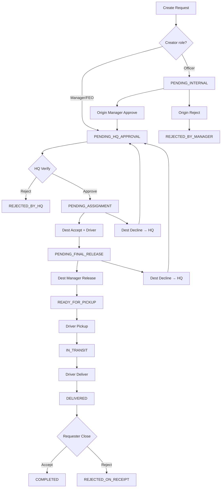

# BranchSync — Complete Project Overview

**Jamuna Bank PLC · Inter-Branch Transfer, Requisition, Cash Vault & Stock Inventory System**

BranchSync is an internal banking operations platform that coordinates the secure movement of physical assets between branches. It enforces a multi-stage approval workflow with **HQ central routing**, branch gatekeeping, courier handoffs, immutable audit trails, and two specialized inventory engines:

- **Cash (CASH behavior)** — vault balances in ৳, note denomination breakdowns, cash ledger, cash manual adjustments  
- **Stock (STOCK behavior)** — per-item quantity tracking by branch, stock ledger, stock manual adjustments  
- **Documents & simple assets (DOCUMENT_CASE behavior)** — workflow-only tracking with no balance/quantity ledger

This document reflects the **current codebase**—every major feature, role, workflow step, screen, API area, and data model.

---

## Table of Contents

1. [Executive Summary](#1-executive-summary)  
2. [Technology Stack](#2-technology-stack)  
3. [Core Concepts & Terminology](#3-core-concepts--terminology)  
4. [Category Behavior Types](#4-category-behavior-types)  
5. [Organizational Architecture](#5-organizational-architecture)  
6. [User Roles — Who Does What](#6-user-roles--who-does-what)  
7. [Item Categories (Seeded)](#7-item-categories-seeded)  
8. [Transfer Lifecycle — Full Workflow](#8-transfer-lifecycle--full-workflow)  
9. [Transfer Status Reference](#9-transfer-status-reference)  
10. [Rejection, Return-to-HQ & Re-Routing](#10-rejection-return-to-hq--re-routing)  
11. [Cash Bundle & Vault Ledger](#11-cash-bundle--vault-ledger)  
12. [Stock Inventory System](#12-stock-inventory-system)  
13. [Frontend — Pages, Routes & Navigation](#13-frontend--pages-routes--navigation)  
14. [Role-Based UI Access Matrix](#14-role-based-ui-access-matrix)  
15. [Backend API Reference](#15-backend-api-reference)  
16. [Database Model](#16-database-model)  
17. [Security, Authentication & Audit](#17-security-authentication--audit)  
18. [Notable Product Features](#18-notable-product-features)  
19. [Project Structure & Related Docs](#19-project-structure--related-docs)  
20. [Local Development](#20-local-development)

---

## 1. Executive Summary

| Aspect | Detail |
|--------|--------|
| **Purpose** | Digitize inter-branch asset requests with enforced approvals, HQ routing, courier tracking, and automated cash/stock ledger updates |
| **Users** | Branch officers, managers, HQ logistics, delivery couriers, system administrators |
| **Workflow** | Up to **8 logical steps** from initiation through HQ allocation, destination handling, transit, and requester sign-off |
| **Inventory** | **CASH** (৳ vault) + **STOCK** (countable units) + **DOCUMENT_CASE** (plain transfers) driven by `item_categories.behavior_type` |
| **Audit** | Append-only `audit_logs` on every transfer action; separate immutable cash and stock ledgers |
| **Repo** | Monorepo: `backend/` (Spring Boot 3, Java 21), `frontend/` (React 18 + TypeScript + Vite), MariaDB schema in `branchsync.sql` |

---

## 2. Technology Stack

| Layer | Technology |
|-------|------------|
| **Frontend** | React 18, TypeScript, Vite, React Router, Axios |
| **Backend** | Spring Boot 3, Java 21, Spring Security, Spring Data JPA |
| **Database** | MariaDB / MySQL |
| **Auth** | JWT (stateless), SHA-256 password hashing |
| **API base** | `http://localhost:8080/api` |
| **UI** | Custom CSS design system (`variables.css`, per-page styles) |

---

## 3. Core Concepts & Terminology

### Origin vs destination (critical)

| Term | Meaning |
|------|---------|
| **Origin branch / department** | Branch that **initiated** the request and **receives** the package at the end (the requester) |
| **Destination branch / department** | Branch **assigned by HQ** to **supply and release** assets; courier **picks up here** |
| **Deferred destination** | Requesters do **not** choose destination at creation—HQ assigns after internal approval |

### Physical & ledger flow

```
[Destination — sender]  ──pickup──►  IN_TRANSIT  ──delivery──►  [Origin — receiver]
```

| Behavior | On pickup (destination) | On delivery (origin) | On receipt reject |
|----------|---------------------------|----------------------|-------------------|
| **CASH** | Debit vault (৳) | Credit vault (৳) | Reverse both |
| **STOCK** | Debit quantity | Credit quantity | Reverse both |
| **DOCUMENT_CASE** | No ledger change | No ledger change | No ledger change |

### Other terms

- **Transfer request** — tracked record with code `REQ-YYYY-####`  
- **Priority** — `NORMAL`, `HIGH`, `URGENT`, `CRITICAL`  
- **Sensitivity** — per category: `LOW`, `MEDIUM`, `HIGH`, `CRITICAL`  
- **Delivery person** — courier; `is_available` false while `IN_TRANSIT`  
- **Stock item** — concrete SKU under a STOCK category (e.g. "Laptop", "A4 Paper Ream")  
- **Audit trail** — actor, action, status transition, remarks, IP, timestamp  

---

## 4. Category Behavior Types

Each `item_category` has a `behavior_type` enum (`CategoryBehavior`) that drives runtime logic—replacing fragile name-based `"Cash Bundle"` checks.

| Behavior | What it enables | Examples (seeded) |
|----------|-----------------|-------------------|
| **CASH** | `requestedAmount`, denomination breakdown, `branch_cash_balance`, `cash_ledger`, cash manual adjustments | Cash Bundle |
| **STOCK** | `stockItemId` + `quantity` on transfer, `branch_stock_balance`, `stock_ledger`, stock manual adjustments, admin-managed `stock_items` | Computers, Stationery Pack, Office Furniture, CCTV Equipment, etc. |
| **DOCUMENT_CASE** | Standard 8-step workflow only—no amount/qty ledger | Cheque Books, Demand Draft, Customer Documents |

**Admin configuration:** Item Management lets `SYSTEM_ADMIN` set behavior when creating/editing categories. Changing behavior on a category with history shows a warning in the UI.

**STOCK categories** expose a nested **Stock Items** panel in admin (name, unit, description, activate/deactivate per SKU).

---

## 5. Organizational Architecture

### Branches

- Table: `branches` — code, name, type (`HQ`, `AD_BRANCH`, `SUB_BRANCH`), district, division, address, phone, `is_active`  
- Admin **Branch Management** (`/admin/branches`): create/edit branches, assign departments via `branch_departments`  

### Departments (global master)

Linked to branches through **`branch_departments`** (many-to-many).

| ID | Department | HQ-only |
|----|------------|---------|
| 1 | Cash Operations | No |
| 2 | IT Department | No |
| 3 | General Administration | No |
| 4 | Security & Compliance | No |
| 5 | Human Resources | No |
| 6 | Customer Service | No |
| 7 | Central Logistics Control | **Yes** |

### Users

- `users` → `roles`, optional `branches`, optional `departments`, `is_active`, `is_available` (delivery)  
- **Item access:** categories with `department_id = NULL` are open to all officers; otherwise officers only see categories mapped to their department on **New Request**  

### Admin organization (split pages)

Previously one `OrgManagement` component; now **four dedicated admin screens**:

| Route | Page |
|-------|------|
| `/admin/users` | User Management |
| `/admin/branches` | Branch Management |
| `/admin/departments` | Department Management |
| `/admin/items` | Item Management (+ stock items for STOCK categories) |

---

## 6. User Roles — Who Does What

| Role | Code | Primary responsibilities |
|------|------|--------------------------|
| **System Admin** | `SYSTEM_ADMIN` | Full org CRUD, all transfers/ledgers, consolidated reports; **cannot** create transfer requests (UI) |
| **HQ Logistics Officer** | `HQ_LOGISTICS_OFFICER` | `PENDING_HQ_APPROVAL` queue; assign destination branch + department; view cash/stock balances when routing; **cannot** create requests |
| **Branch Manager** | `BRANCH_MANAGER` | Internal approve/reject (origin); final release (destination); approve cash/stock adjustments; branch directory |
| **Operation Manager** | `OPERATION_MANAGER` | Same powers as Branch Manager |
| **First Executive Officer** | `FIRST_EXECUTIVE_OFFICER` | Same as manager; **bypasses** `PENDING_INTERNAL` on create |
| **Officer** | `OFFICER` | Create requests; destination accept + driver; cash adjust (Cash Ops dept only); stock adjust (dept-scoped); final receipt verify |
| **Delivery Person** | `DELIVERY_PERSON` | Pickup and deliver assigned transfers only |

### Dashboard data scope (active transfers)

| Role | Sees |
|------|------|
| `SYSTEM_ADMIN` | All active transfers |
| `HQ_LOGISTICS_OFFICER` | Only `PENDING_HQ_APPROVAL` |
| `DELIVERY_PERSON` | Transfers assigned to them |
| `OFFICER` | Origin or destination matching **branch + department** |
| Managers / FEO | All transfers involving their branch (destination hidden until post-HQ) |

### History (terminal transfers)

Statuses: `COMPLETED`, `REJECTED_ON_RECEIPT`, `CANCELLED`, `REJECTED_BY_HQ`, `REJECTED_BY_MANAGER`.

---

## 7. Item Categories (Seeded)

| Category | Behavior | Dept | Sensitivity |
|----------|----------|------|-------------|
| Cash Bundle | CASH | Cash Operations | CRITICAL |
| Cheque Books | DOCUMENT_CASE | Cash Operations | HIGH |
| Demand Draft | DOCUMENT_CASE | Cash Operations | HIGH |
| Computers | STOCK | IT | HIGH |
| Network Equipment | STOCK | IT | MEDIUM |
| Office Equipment | STOCK | IT | MEDIUM |
| Stationery Pack | STOCK | General Admin | LOW |
| Printed Forms | STOCK | General Admin | LOW |
| Office Furniture | STOCK | General Admin | LOW |
| CCTV Equipment | STOCK | Security | CRITICAL |
| Customer Documents | DOCUMENT_CASE | Customer Service | MEDIUM |

**Stock items** (39 seeded SKUs) include laptops, routers, forms, chairs, CCTV units, stationery packs, etc.—see `stock_items` in `branchsync.sql`.

---

## 8. Transfer Lifecycle — Full Workflow



### Step 0 — Initiation

| | |
|---|---|
| **Who** | Officers, Managers, FEO — **not** HQ, Delivery, or System Admin |
| **Route** | `/transfers/new` |
| **API** | `POST /api/transfers` |
| **Fields** | Title, description, category, priority |
| **CASH extra** | `requestedAmount` (৳) |
| **STOCK extra** | `stockItemId`, `quantity` (from `/api/lookup/stock-items/{categoryId}`) |
| **Auto-set** | Origin branch/dept, initiator, `requestCode`, timestamps |
| **Destination** | Always null until HQ assigns |
| **Initial status** | `PENDING_INTERNAL` or `PENDING_HQ_APPROVAL` (manager bypass) |

### Step 1 — Origin internal approval

| | |
|---|---|
| **Who** | Manager/FEO at **origin** |
| **Approve** | `POST .../approve-internal` → `PENDING_HQ_APPROVAL` |
| **Reject** | `POST .../reject-internal` + note → `REJECTED_BY_MANAGER` |

### Step 2 — HQ audit & routing

| | |
|---|---|
| **Who** | `HQ_LOGISTICS_OFFICER` |
| **API** | `POST .../hq-verify` |
| **Approve body** | `{ approved: true, destinationBranchId, destinationDepartmentId }` → `PENDING_ASSIGNMENT` |
| **Reject body** | `{ approved: false, rejectionNote }` → `REJECTED_BY_HQ` |
| **UI** | Department dropdown filtered by branch; **LOW CASH** / balance context for CASH; stock balance context for STOCK |

### Step 3 — Destination accept & assign driver

| | |
|---|---|
| **Who** | Destination branch staff |
| **API** | `POST .../accept` + `{ deliveryPersonId }` → `PENDING_FINAL_RELEASE` |
| **CASH** | Must submit denominations first (`POST /api/cash/denominations/{id}`); total must match amount; destination vault must cover total |
| **STOCK** | Item/qty already on request; UI shows **LOW STOCK** if destination quantity insufficient |
| **Decline** | `POST .../reject-destination` → clears routing → `PENDING_HQ_APPROVAL` |
| **Driver** | Only `DELIVERY_PERSON` with `is_available = true` |

### Step 4 — Destination final release

| | |
|---|---|
| **Who** | Manager/FEO at **destination** |
| **Release** | `POST .../release` → `READY_FOR_PICKUP` |
| **Decline** | `POST .../reject-release` → clears routing, driver, acceptor → `PENDING_HQ_APPROVAL` |

### Step 5 — Courier pickup

| | |
|---|---|
| **Who** | Assigned driver only |
| **API** | `POST .../pickup` → `IN_TRANSIT`; driver busy |
| **CASH** | `recordTransferOut` at destination |
| **STOCK** | `recordTransferOut` at destination (qty) |

### Step 6 — Courier delivery

| | |
|---|---|
| **Who** | Same driver |
| **API** | `POST .../deliver` → `DELIVERED`; driver available |
| **CASH** | `recordTransferIn` at origin |
| **STOCK** | `recordTransferIn` at origin |

### Step 7 — Requester verification

| | |
|---|---|
| **Who** | Original initiator only |
| **API** | `POST .../close` + `{ accepted, finalNote }` |
| **Accept** | `COMPLETED` |
| **Reject** | `REJECTED_ON_RECEIPT` + cash/stock reversals |

---

## 9. Transfer Status Reference

| Status | Next actor (typical) |
|--------|----------------------|
| `PENDING_INTERNAL` | Origin manager |
| `PENDING_HQ_APPROVAL` | HQ logistics |
| `PENDING_ASSIGNMENT` | Destination staff |
| `PENDING_FINAL_RELEASE` | Destination manager |
| `READY_FOR_PICKUP` | Delivery person |
| `IN_TRANSIT` | Delivery person |
| `DELIVERED` | Original requester |
| `COMPLETED` | — (terminal) |
| `REJECTED_ON_RECEIPT` | — (terminal) |
| `REJECTED_BY_MANAGER` | — (terminal) |
| `REJECTED_BY_HQ` | — (terminal) |
| `CANCELLED` | — (terminal) |

---

## 10. Rejection, Return-to-HQ & Re-Routing

| Action | Result |
|--------|--------|
| Origin `reject-internal` | Terminal `REJECTED_BY_MANAGER` |
| HQ reject | Terminal `REJECTED_BY_HQ` |
| Destination `reject-destination` | Reset destination → `PENDING_HQ_APPROVAL` for re-allocation |
| Destination `reject-release` | Reset destination, driver, acceptor → `PENDING_HQ_APPROVAL` |
| Requester reject on receipt | `REJECTED_ON_RECEIPT` + ledger reversals (CASH/STOCK) |

---

## 11. Cash Bundle & Vault Ledger

### Scope

`behavior_type = CASH` (seeded: **Cash Bundle**).

### Features

- Real-time **৳ balance** per branch (`branch_cash_balance`)  
- **Denomination breakdown** at destination acceptance (৳1000 … ৳1); must equal `requestedAmount`  
- **Low cash warnings** on HQ routing and transfer detail  
- **Manual adjustments:** Cash Operations officers submit; managers approve; debit guarded against balance  
- **Immutable `cash_ledger`** — `TRANSFER_OUT`, `TRANSFER_IN`, `REVERSAL_*`, `MANUAL_ADJUSTMENT`  
- **Print exports:** landscape branch report; admin portrait consolidated all-branch report  

### Cash access rules

| Action | Who |
|--------|-----|
| View cash ledger | Admin, managers, **Cash Operations officers** (dept name contains "cash") |
| Submit cash adjustment | **Cash Operations officers** only |
| Approve cash adjustment | Managers/FEO (same branch) |
| Pending list on dashboard | Managers (cash adjust widget) |

### Cash API (`/api/cash`)

| Method | Path | Purpose |
|--------|------|---------|
| GET | `/balances` | All branch vault balances |
| GET | `/balance/{branchId}` | Single branch balance |
| GET | `/ledger/{branchId}` | Cash ledger entries |
| POST | `/denominations/{requestId}` | Submit note breakdown |
| GET | `/denominations/{requestId}` | Read breakdown |
| POST | `/adjust` | Submit manual adjustment |
| POST | `/adjust/{id}/decide` | Approve/reject |
| GET | `/adjust/pending` | Pending for branch |
| GET | `/adjust/all` | Adjustment history |

### Frontend

| Route | Page |
|-------|------|
| `/cash/ledger` | Cash Ledger |
| `/cash/adjust` | Cash Adjustments |

---

## 12. Stock Inventory System

### Scope

`behavior_type = STOCK` on category; quantities tracked per **`stock_item`** per **branch**.

### Features

- **Per-branch, per-SKU balance** (`branch_stock_balance`)  
- **Transfer hooks:** debit destination on pickup, credit origin on delivery, reverse on receipt reject  
- **Manual adjustments:** officers submit (+/− qty + reason); managers approve; debit validated against on-hand qty  
- **Department scoping:** officers may only adjust stock items whose category maps to their department (or open categories)  
- **Immutable `stock_ledger`** — same entry types as cash but integer quantities  
- **HQ / admin visibility:** `GET /api/stock/balances` for system-wide view; branch-scoped lists for managers  

### Stock access (sidebar & backend)

| Feature | Admin | HQ | Manager | Officer | Delivery |
|---------|:-----:|:--:|:-------:|:-------:|:--------:|
| Stock Ledger | ✅ | ✅ | ✅ | ✅ | ❌ |
| Stock Adjustments | ❌ | ❌ | ✅ approve | ✅ submit | ❌ |

Officers viewing ledger see entries filtered to their department’s stock categories (unless open access).

### Stock API (`/api/stock`)

| Method | Path | Purpose |
|--------|------|---------|
| GET | `/balances` | All branch×item balances (admin/HQ routing) |
| GET | `/balances/{branchId}` | Balances at one branch |
| GET | `/balance/{branchId}/{stockItemId}` | Single SKU balance |
| GET | `/ledger/{branchId}/{stockItemId}` | Ledger (`stockItemId=0` = all items at branch) |
| POST | `/adjust` | Submit adjustment |
| POST | `/adjust/{id}/decide` | Approve/reject |
| GET | `/adjust/pending` | Pending for manager’s branch |
| GET | `/adjust/all` | History (`?branchId=` optional) |

### Admin stock item API (`/api/admin/org`)

| Method | Path |
|--------|------|
| GET | `/items/{categoryId}/stock-items` |
| POST | `/items/{categoryId}/stock-items` |
| PUT | `/stock-items/{stockItemId}` |
| PUT | `/stock-items/{stockItemId}/toggle-active` |

### Lookup

| Method | Path |
|--------|------|
| GET | `/api/lookup/stock-items/{categoryId}` | Active SKUs for New Request form |
| GET | `/api/lookup/categories` | Includes `behaviorType` per category |

### Frontend

| Route | Page |
|-------|------|
| `/stock/ledger` | Stock Ledger (branch picker, SKU pills, movement table, print) |
| `/stock/adjust` | Stock Adjustments (submit + manager approval + history) |

---

## 13. Frontend — Pages, Routes & Navigation

### Public

| Route | Page |
|-------|------|
| `/login` | Employee ID + password login |

### Protected (Layout + Sidebar)

| Route | Page | Notes |
|-------|------|-------|
| `/` | Dashboard | Attention Required widget, active transfers, behavior badges |
| `/transfers/new` | New Request | CASH amount / STOCK item+qty fields |
| `/transfers/:id` | Transfer Details | Full workflow actions, print slip, duplicate |
| `/transfers/history` | History | Filters, search, print/PDF export |
| `/branch-directory` | Branch Directory | Managers only |
| `/profile` | Profile | View profile, change password |
| `/cash/ledger` | Cash Ledger | Managers, cash officers, admin |
| `/cash/adjust` | Cash Adjustments | Managers + cash officers |
| `/stock/ledger` | Stock Ledger | Managers, officers, admin, HQ |
| `/stock/adjust` | Stock Adjustments | Managers + officers |
| `/admin/users` | User Management | Admin |
| `/admin/branches` | Branch Management | Admin |
| `/admin/departments` | Department Management | Admin |
| `/admin/items` | Item Management | Admin — behavior type, stock SKUs, toggle category active |

### Transfer Details — role/action summary

| Stage | Typical actor | Key actions |
|-------|---------------|-------------|
| `PENDING_INTERNAL` | Origin manager | Approve / reject |
| `PENDING_HQ_APPROVAL` | HQ officer | Verify & route / reject; balance warnings |
| `PENDING_ASSIGNMENT` | Dest. staff | Denominations (CASH), accept + driver / decline to HQ |
| `PENDING_FINAL_RELEASE` | Dest. manager | Release / decline to HQ |
| `READY_FOR_PICKUP` / `IN_TRANSIT` | Driver | Pickup / deliver |
| `DELIVERED` | Requester | Accept & close / reject |

**Extras:** Print slip (route, priority, sensitivity, cash denominations, stock item/qty); **Duplicate Request** (blocked for HQ & delivery).

### Dashboard — Attention Required

Flags transfers the user can act on **now**, plus **pending cash adjustments** for managers (links to `/cash/adjust`). Stock pending adjustments are handled on the Stock Adjustments page (managers fetch `/stock/adjust/pending` there).

---

## 14. Role-Based UI Access Matrix

| Feature | Admin | HQ | Mgr/FEO | Officer | Delivery |
|---------|:-----:|:--:|:-------:|:-------:|:--------:|
| Dashboard (all/active) | ✅ all | ✅ HQ queue | ✅ branch | ✅ dept | ✅ assigned |
| New Request | ❌ | ❌ | ✅ | ✅ | ❌ |
| History | ✅ | ✅ | ✅ | ✅ | ✅ |
| Branch Directory | ❌ | ❌ | ✅ | ❌ | ❌ |
| Cash Ledger | ✅ | ❌ | ✅ | ✅ cash dept | ❌ |
| Cash Adjust | ❌ | ❌ | ✅ approve | ✅ cash dept submit | ❌ |
| Stock Ledger | ✅ | ✅ | ✅ | ✅ dept-scoped | ❌ |
| Stock Adjust | ❌ | ❌ | ✅ approve | ✅ submit | ❌ |
| Admin panels | ✅ | ❌ | ❌ | ❌ | ❌ |
| Duplicate / Print slip | ✅ | ✅ | ✅ | ✅ | ✅ |

---

## 15. Backend API Reference

Base: `/api` · Auth: `Authorization: Bearer <JWT>` (login public; lookups permit-all in `SecurityConfig`).

### Authentication

| POST | `/auth/login` |

### Transfers

| Method | Path |
|--------|------|
| GET | `/transfers`, `/transfers/history`, `/transfers/{id}` |
| POST | `/transfers` |
| POST | `/transfers/{id}/approve-internal` |
| POST | `/transfers/{id}/reject-internal` |
| POST | `/transfers/{id}/hq-verify` |
| POST | `/transfers/{id}/accept` |
| POST | `/transfers/{id}/reject-destination` |
| POST | `/transfers/{id}/release` |
| POST | `/transfers/{id}/reject-release` |
| POST | `/transfers/{id}/pickup` |
| POST | `/transfers/{id}/deliver` |
| POST | `/transfers/{id}/close` |

### Users

| GET | `/users/profile`, `/users/branch-directory` |

### Admin users

| GET/POST | `/admin/users` |
| PUT | `/admin/users/{userId}`, `/admin/users/{userId}/toggle-active` |

### Admin organization

| GET/POST/PUT | `/admin/org/branches`, `/admin/org/departments` |
| GET/POST/PUT | `/admin/org/items` |
| PUT | `/admin/org/items/{id}/map`, `/admin/org/items/{id}/toggle-active` |
| DELETE | `/admin/org/items/{categoryId}` |
| GET/POST | `/admin/org/items/{categoryId}/stock-items` |
| PUT | `/admin/org/stock-items/{id}`, `.../toggle-active` |
| GET | `/admin/org/roles` |

### Lookups

| GET | `/lookup/branches`, `/departments`, `/branches/{id}/departments`, `/roles`, `/categories`, `/stock-items/{categoryId}`, `/users/delivery-persons/available` |

---

## 16. Database Model

### Core

| Table | Purpose |
|-------|---------|
| `users`, `roles` | Accounts & RBAC |
| `branches`, `departments`, `branch_departments` | Org structure |
| `item_categories` | Categories + `behavior_type`, `is_active`, sensitivity, responsible dept |
| `transfer_requests` | Workflow state, routing, cash amount, `stock_item_id`, `quantity`, `denominations_submitted` |
| `audit_logs` | Per-action immutable audit |

### Cash

| Table | Purpose |
|-------|---------|
| `branch_cash_balance` | Live ৳ per branch |
| `cash_ledger` | Vault movements |
| `cash_transfer_denominations` | Note breakdown per transfer |
| `cash_manual_adjustments` | Pending/approved vault corrections |

### Stock

| Table | Purpose |
|-------|---------|
| `stock_items` | SKUs under STOCK categories |
| `branch_stock_balance` | Live qty per (branch, stock_item) |
| `stock_ledger` | Quantity movements |
| `stock_manual_adjustments` | Pending/approved stock corrections |

---

## 17. Security, Authentication & Audit

### Auth flow

1. Login → JWT + user identity (`employeeId`, `role`, `branchId`, `departmentId`, `departmentName`)  
2. Stored in `localStorage`; Axios attaches Bearer token  
3. 401 → redirect to login  

### Authorization

- **Frontend:** Sidebar and action buttons gated by role  
- **Backend:** Service-layer checks → `UnauthorizedRoleException` (403), `BusinessRuleViolationException` (400)  

### Audit log visibility (transfer detail)

| Role | Visibility |
|------|------------|
| Admin, HQ | Full log |
| Manager/FEO | Full if transfer involves their branch |
| Officer | Full if origin/dest matches branch **and** department |
| Delivery | Subset of own assignment: assign, pickup, deliver, complete, reject |

---

## 18. Notable Product Features

- **Behavior-driven categories** — CASH / STOCK / DOCUMENT_CASE replaces hard-coded name checks  
- **HQ deferred routing** — destination assigned centrally with branch-filtered departments  
- **Return-to-HQ re-routing** — destination decline without killing the request  
- **Manager initiation bypass** — skips internal pending, still requires HQ  
- **Attention Required** dashboard widget  
- **One-click duplicate request**  
- **Professional print slip** — cash denominations + stock lines  
- **Dual ledger systems** — cash (৳) and stock (units) with parallel adjustment workflows  
- **Low balance / low stock warnings** at HQ and destination acceptance  
- **Delivery availability** — busy flag during transit  
- **Category activate/deactivate** — admin can disable categories without deleting history  
- **39 seeded stock SKUs** across IT, admin, security categories  

---

## 19. Project Structure & Related Docs

```
BranchSync/
├── backend/                    Spring Boot API
│   └── src/main/java/.../
│       ├── controller/         Auth, Transfer, Cash, Stock, Lookup, Org, Users
│       ├── service/impl/       Transfer, Cash, Stock, Management, Audit
│       ├── model/entity/       JPA entities
│       └── model/enums/        CategoryBehavior, BranchType
├── frontend/                   React SPA
│   └── src/pages/              Dashboard, transfers, cash, stock, admin/*
├── backend/.../db/migration/   branchsync.sql (full schema + seed)
├── README.md                   Setup quick reference
├── BUSINESS_OVERVIEW.md        Plain-language bank staff guide
├── SYSTEM_OVERVIEW.md          Module-oriented demo reference
├── stock_behavior_plan.md      Design notes for STOCK feature
└── PROJECT_OVERVIEW.md         This document
```

---

## 20. Local Development

### Prerequisites

Java 21 · Maven 3.9+ · Node.js 22+ · MariaDB/MySQL

### Database

1. Create database `branchsync`  
2. Run `backend/src/main/resources/db/migration/branchsync.sql`  
3. Optional: scripts under `backend/src/main/resources/db/test data/`  

### Run

```bash
cd backend && mvn spring-boot:run    # http://localhost:8080
cd frontend && npm install && npm run dev   # http://localhost:5173
```

---

## System Layers (Summary)

```
┌──────────────────────────────────────────────────────────────────┐
│  React UI — Transfers · Cash · Stock · Admin · Directory         │
└────────────────────────────┬─────────────────────────────────────┘
                             │ JWT / REST
┌────────────────────────────▼─────────────────────────────────────┐
│  Spring Services — Transfer state machine + CashService + StockService │
└────────────────────────────┬─────────────────────────────────────┘
                             │ JPA
┌────────────────────────────▼─────────────────────────────────────┐
│  MariaDB — transfers · audit · org master · cash vault · stock qty   │
└────────────────────────────────────────────────────────────────────┘
```

---

*BranchSync — Jamuna Bank PLC · Developed by [Jawadur Rafid](https://jawadur.me)*

*Document aligned with codebase including category `behavior_type`, stock inventory module, and split admin pages.*
